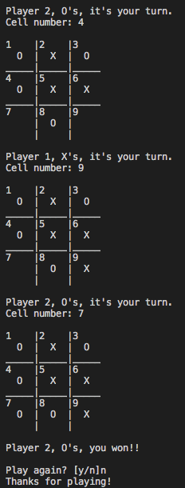

# Command Line Tic Tac Toe

by Peter Meglis
created: 4 May 2020

---

The classic 2-player [tic tac toe](https://en.wikipedia.org/wiki/Tic-tac-toe) game played on the command line!

**To play:**
`$ ruby tic_tac_toe_game.rb`

If you'd like to play with symbols other than X's and O's, feel free to uncomment `g = TicTacToeGame.new` instead, located at the bottom of tic_tac_toe_game.rb, to choose your own.

```
  # Quick start, comment this out if you use the below line
  g = TicTacToeGame.new("X", "O")

  # Custom symbol choices, uncomment this instead:
  # g = TicTacToeGame.new
  
  g.play
```





---

Ackowledgements: [The Odin Project](https://www.theodinproject.com/courses/ruby-programming/lessons/oop) curriculum.
